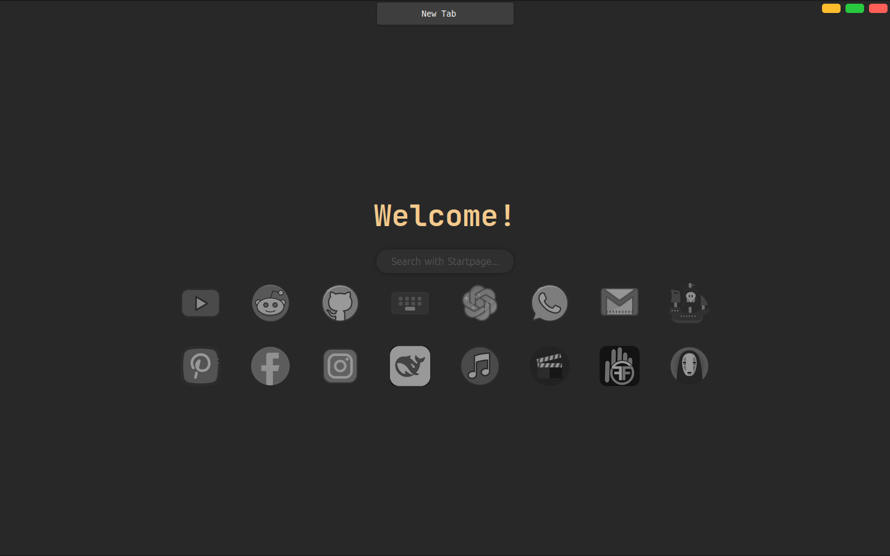

# 🌟 Custom New Tab Page

A **minimalist and stylish** custom **New Tab page** designed for browsers like Chrome and Firefox. It features a **dark theme**, custom icons, and JetBrains Mono font.

## 📸 Preview


## ✨ Features
- 🔥 **Minimalist Dark UI**  
- 🎨 **Custom Font (JetBrains Mono Bold)**  
- ⚡ **Quick Access Icons** (YouTube, Reddit, GitHub, etc.)  
- 🌍 **Fully Responsive Design**

### **1️⃣ Host on GitHub Pages**
1. **Fork this repository** and clone it:  
   ```sh
   git clone https://github.com/siam404/custom-new-tab.git
